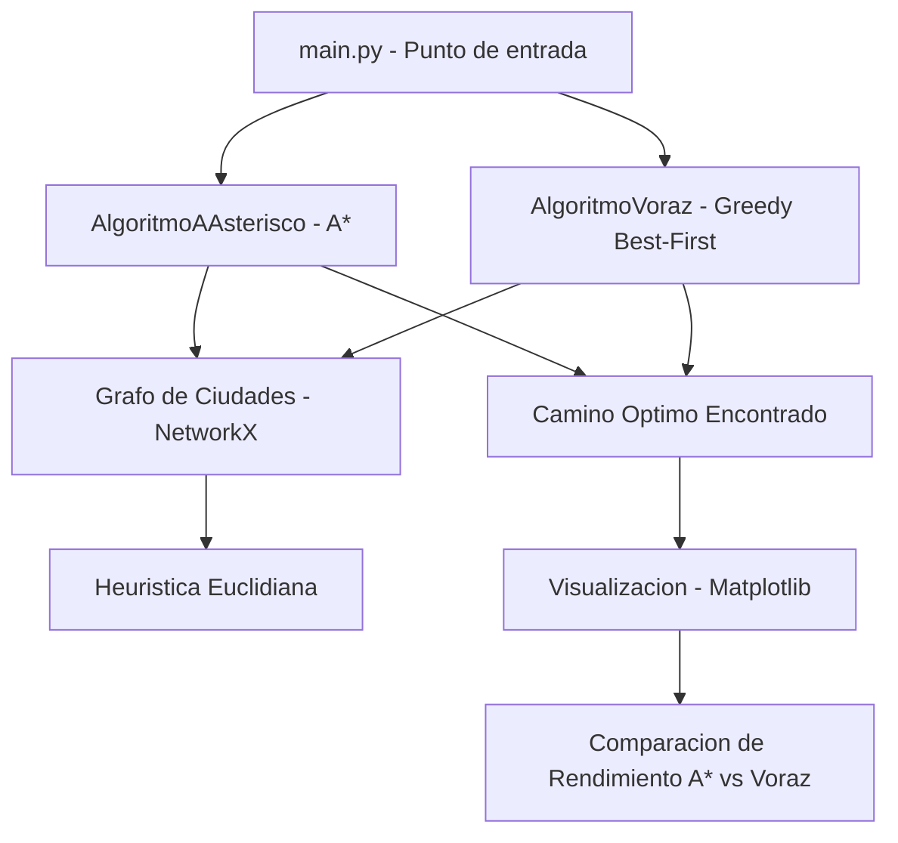

<div align="center">

# 📌 Inteligencia Artificial - Resolver el Problema del Camino Más Corto Mediante Búsqueda Informada  

## 📖 Descripción

</div>

---

Este proyecto aplica algoritmos de búsqueda informada para encontrar el camino más corto en grafos representando redes de ciudades.

## 🛠️ Funcionalidades  
- Implementación de algoritmos A* y Búsqueda Voraz.  
- Visualización de grafos con NetworkX.  
- Cálculo de heurísticas basadas en distancia euclidiana.  
- Comparación de rendimiento entre diferentes métodos de búsqueda.  

## Arquitectura



## 🚀 Tecnologías utilizadas  
- Python  
- NetworkX  
- Algoritmos de búsqueda IA  
- Matplotlib  

## ▶️ Cómo ejecutar el proyecto  
1. Instalar dependencias con:  
   ```bash
   pip install -r requirements.txt
   ```
2. Ejecutar el programa principal:  
   ```bash
   python main.py
   ```
3. Analizar los resultados generados y optimizar los parámetros.  

## 📌 Autor  
👨‍💻 **Alejandro De Mendoza**

---

## Autor

**Alejandro De Mendoza**  
Ingeniero Informático · Especialista en IA · Especialista en Ingeniería de Software · Máster en Arquitectura de Software

[](https://github.com/AlejoTechEngineer)
